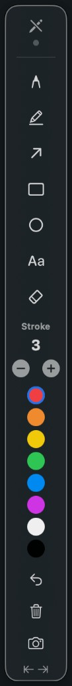

# DrawOver — User Guide

DrawOver is a free macOS menu-bar app that lets you **draw on top of any application** — presentations, browsers, design tools, video calls, and more. Your annotations appear on a transparent overlay layer that screen sharing tools (Zoom, Teams, OBS, Loom) can capture along with your desktop.

When you finish, turn drawing off and everything disappears from the screen. Nothing is saved to your files unless you take a **snapshot**.

---

## What you see on screen

| Element | What it does |
|---------|----------------|
| **Menu bar pencil** | Start/stop DrawOver, open settings, quit |
| **Floating toolbar** | Pick tools, colors, stroke width, undo, snapshot |
| **Green dot** (top of toolbar) | **On** = drawing mode active · **Off** = annotations hidden |
| **Transparent overlay** | Full-screen layer where your marks appear |

---

## The toolbar

| # | Control | Purpose |
|---|---------|---------|
| 1 | **Green dot / pencil** | Turn drawing **on** or **off**. When off, all marks vanish from the screen. |
| 2 | **Pen** | Freehand lines |
| 3 | **Highlighter** | Semi-transparent thick strokes |
| 4 | **Arrow** | Straight arrow callout |
| 5 | **Rectangle** | Box shapes + advanced callouts (see below) |
| 6 | **Ellipse** | Oval / circle shapes |
| 7 | **Text** | Click anywhere to type a label |
| 8 | **Eraser** | Remove strokes you drag over |
| 9 | **Stroke** `−` / `+` | Thinner or thicker lines (pen, arrow, shapes) |
| 10 | **Color dots** | Pick stroke color (selected ring = active color) |
| 11 | **Undo** | Undo last change |
| 12 | **Trash** | Clear all annotations |
| 13 | **Camera** | Snapshot active monitor to clipboard |
| 14 | **Dock arrows** | Snap toolbar to left or right screen edge |

> **Tip:** Hover any toolbar button to see its name and keyboard shortcut.

---

## Getting started (5 steps)

1. **Launch** `DrawOver.app` (see [README](../README.md) for download instructions).
2. **Grant permissions** when macOS asks — **Accessibility** (hotkeys) and **Screen Recording** (snapshots).
3. Click the **menu bar pencil** or press **⌥D** to enable drawing.
4. Click the **green dot** on the toolbar so it turns **green** — drawing mode is now on.
5. Pick a tool, choose a color, and draw on your screen.

**To stop:** click the green dot again (or press **Esc**). Your marks disappear immediately.

---

## Drawing tools

### Pen

Best for quick freehand circles, underlines, and rough callouts.

1. Select **Pen** (or press **⌥1**).
2. Adjust **Stroke** thickness with `−` / `+`.
3. **Click and drag** anywhere on screen.

---

### Highlighter

Best for emphasizing text or UI without fully covering it.

1. Select **Highlighter** (**⌥2**).
2. Drag over the area — strokes are semi-transparent and wider than the pen.

---

### Arrow

Best for pointing at a single spot.

1. Select **Arrow** (**⌥3**).
2. **Click and drag** from start point to tip.
3. Release to place the arrow.

---

### Rectangle (basic)

Best for framing UI elements, regions, or bugs.

1. Select **Rectangle** (**⌥4**).
2. **Click and drag** diagonally to draw a box.
3. Release to finish.

---

### Rectangle — advanced callouts

The rectangle tool supports several power-user gestures:

#### Draw an arrow while on the rectangle tool

Hold **⌃ (Control)** and drag — draws an arrow instead of a box.

| Gesture | Result |
|---------|--------|
| **Drag** | Rectangle |
| **⌃ + drag** | Arrow |
| **⇧ + drag** | Rectangle, then caption field opens below the box |
| **⌃ + drag starting on an existing box** | Callout arrow from the **nearest edge** of that box to your cursor |

#### Callout arrow from a box (leader line)

1. Draw a rectangle first.
2. Keep **Rectangle** selected.
3. Hold **⌃** and drag **from inside or on the box** outward — the arrow starts at the box edge and points to where you release.

This is ideal for labeling a UI element and pointing to a detail elsewhere.

#### Captions (text labels under a box)

| How | What happens |
|-----|----------------|
| **Double-click** an existing rectangle | Caption editor opens **below the box** |
| **⇧ + drag** a new rectangle | Box is drawn, then caption opens automatically |
| **Speech-bubble button** (appears when Rectangle/Ellipse is active) | Toggle **auto-caption** — every new box opens a caption field |
| **Type and press Return** | Caption is committed under the box |
| **Esc** while caption is open | Cancel caption (does not exit drawing) |

#### Move a caption

With **Rectangle** or **Ellipse** selected, **click and drag** an existing caption text to reposition it.

#### Delete shapes, arrows, or captions

With **Rectangle** or **Ellipse** selected, hold **⌥ (Option)** and **click** the item you want to remove.

---

### Ellipse

Same gestures as rectangle (including **⌃-drag** arrows and captions), but draws an oval instead of a square.

1. Select **Ellipse** (**⌥5**).
2. Drag to size the oval.

---

### Text

Best for standalone labels not tied to a shape.

1. Select **Text** (**⌥6**).
2. **Click** where you want text — a small field appears.
3. Type your label and press **Return** to commit.
4. **Click outside** the field to commit without Return.
5. Only **one text field** is open at a time.

**Esc** while the text tool is active exits drawing mode entirely.

---

### Eraser

1. Select **Eraser** (**⌥7**).
2. **Click and drag** over strokes to remove them.

---

## Keyboard shortcuts (defaults)

| Shortcut | Action |
|----------|--------|
| **⌥D** | Toggle drawing on/off (from any app) |
| **Esc** | Stop drawing / dismiss caption |
| **⌥C** | Clear all annotations |
| **⌘Z** | Undo |
| **⌘S** | Snapshot to clipboard |
| **⌥1** – **⌥7** | Select tools (pen → eraser) |

Customize shortcuts in **menu bar → Settings → Shortcuts**.

---

## Menu bar actions

**Right-click** the menu bar pencil icon:

| Item | Action |
|------|--------|
| Enable / Disable DrawOver | Master on/off switch |
| Start / Stop Drawing | Same as **⌥D** |
| Clear All | Remove every annotation |
| Snapshot | Copy screen + annotations to clipboard |
| Hide Toolbar | Remove floating toolbar (drawing still works via hotkeys) |
| Settings | Opacity, dock position, shortcuts |
| Quit | Exit DrawOver |

---

## Snapshots

1. Draw your annotations.
2. Click the **camera** icon on the toolbar or press **⌘S**.
3. DrawOver captures the **monitor you last used** (where you drew or moved the toolbar).
4. The image is copied to your **clipboard** — paste into Slack, email, Notes, etc.

Annotations are composited into the image automatically.

---

## Settings worth knowing

Open **Settings** from the menu bar:

| Setting | What it does |
|---------|----------------|
| **Show toolbar** | Show/hide the floating panel |
| **Transparent background** | Frosted-glass toolbar look |
| **Opacity** | How solid the toolbar appears |
| **Dock** | Float, or pin toolbar to left/right edge |
| **Clear annotations when turning drawing off** | Wipe marks when green dot turns off (on by default) |
| **Auto-caption every new box** | Same as the speech-bubble toolbar toggle |

---

## Common workflows

### Presenting in Zoom / Teams

1. Start your meeting and share your screen.
2. Press **⌥D** → green dot on → annotate live.
3. Press **Esc** or click green dot off when done — audience sees a clean screen again.

### Bug report with screenshot

1. Reproduce the bug on screen.
2. Draw a **rectangle** around the issue.
3. **⌃-drag** a callout arrow to the broken detail.
4. **Double-click** the box → add a caption ("Submit button disabled").
5. Press **⌘S** → paste into Jira / Slack / email.

### Quick highlight in a doc

1. **⌥D** → **Highlighter** → drag over the sentence.
2. **Esc** when finished.

---

## Troubleshooting

| Problem | Fix |
|---------|-----|
| Hotkeys don't work | **System Settings → Privacy & Security → Accessibility** → enable DrawOver |
| Snapshot is blank or blocked | Enable **Screen Recording** for DrawOver |
| Can't type a caption | Click the caption field; overlay must have keyboard focus |
| Marks stay after green dot off | Update to latest build; green dot off should clear the overlay |
| App won't open (unsigned) | Right-click **DrawOver.app → Open → Open** |

---

## Need help or want to contribute?

- **GitHub:** [github.com/vamdevz/drawover](https://github.com/vamdevz/drawover)
- **Source & builds:** see [README](../README.md)

DrawOver is open source (MIT). Feedback and pull requests are welcome.
